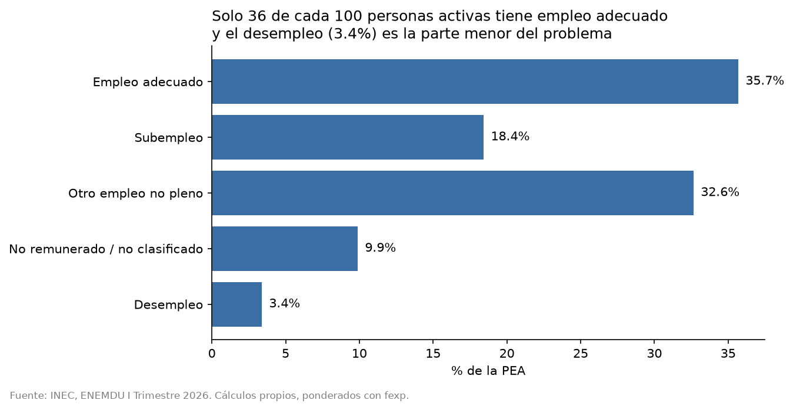
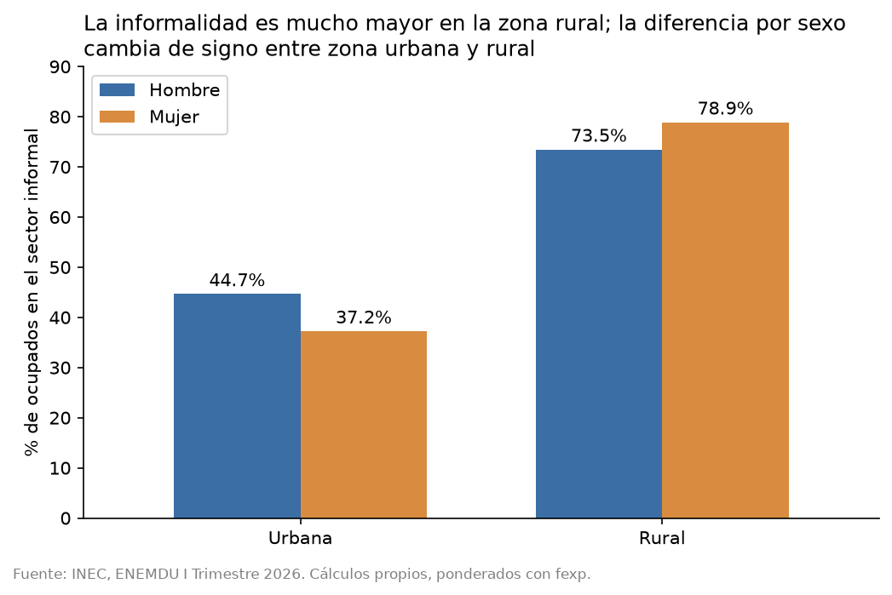
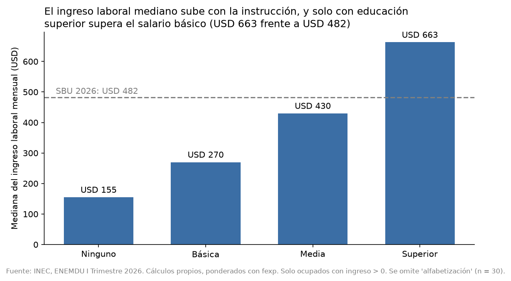

# Mercado laboral ecuatoriano con ENEMDU (I Trimestre 2026)

> Análisis de microdatos de la ENEMDU del INEC: indicadores laborales ponderados y validados contra las cifras oficiales, brechas por sexo y zona, informalidad e ingresos.

**Estado:** en progreso. Completado: validación contra el INEC, análisis descriptivo (9 gráficos) y modelo de ingresos. Pendiente: SQL, dashboard e informe.

## Hallazgo principal

El desempleo es 3,4%, pero solo unas 36 de cada 100 personas activas tienen empleo adecuado. La precariedad se concentra en la zona rural, entre quienes tienen menos instrucción, y en la agricultura, que reúne a la mitad de los trabajadores informales.





Más gráficos en `reports/figures/` (edad, rama, etnia, pirámide de la PEA, brecha de ingreso).

## Resumen ejecutivo

- Los indicadores calculados reproducen las cifras oficiales: 3 de 4 nacionales exactos, 20 de 20 por dominio e informalidad (53,5%).
- Solo 35,7% de la PEA tiene empleo adecuado; 32,6% está en "otro empleo no pleno".
- La zona rural tiene el menor desempleo (1,7%) y el menor empleo adecuado (18,0%).
- La agricultura es 32,3% de ocupados y 51,9% de los informales.
- La informalidad baja de 90,0% sin estudios a 19,6% con educación superior; el ingreso mediano sube de USD 155 a USD 663.
- Cada año de estudio se asocia con un 9% más de ingreso mensual (sin otros controles); con horas y rama, 4,4%.
- La brecha de ingreso de las mujeres va de −2,5% a −29,6% según los controles y la muestra. Depende sobre todo de las horas trabajadas. No es una medida de discriminación.

## Preguntas

1. ¿Cómo está compuesto el empleo en Ecuador y qué proporción es adecuado?
2. ¿Qué brechas hay por sexo, zona y educación en empleo, informalidad e ingresos?
3. ¿Cuánto rinde la educación en ingresos, y qué parte de la brecha por sexo persiste con controles? `[por completar]`

## Datos

- **Fuente:** INEC, Encuesta Nacional de Empleo, Desempleo y Subempleo (ENEMDU), I Trimestre 2026, base de personas (SPSS).
- **Tamaño:** 82.894 registros y 143 variables; se cargan 22 (ver `docs/diccionario_variables.md`).
- **Licencia de los datos:** Creative Commons Atribución 4.0 (INEC).
- Los microdatos no están en el repositorio.

## Metodología

- Todos los indicadores se ponderan con el factor de expansión `fexp`.
- Definiciones con `condact`: ocupados 1 a 6; PEA 1 a 8; PET 1 a 9; informalidad = sector informal (`secemp` = 2) sobre ocupados.
- Códigos especiales de `ingrl` (-1 y 999999) tratados como nulos.
- Años de estudio construidos a partir de nivel y año aprobado (regla en el diccionario; los puntos de partida 13 y 17 son una convención propia).

## Validación contra cifras oficiales

**Nacional (en % de la PEA):**

| Indicador | Calculado | INEC | Diferencia |
|---|---|---|---|
| Participación global | 63,7 | 63,8 | -0,1 |
| Empleo adecuado | 35,7 | 35,7 | 0,0 |
| Subempleo | 18,4 | 18,4 | 0,0 |
| Desempleo | 3,4 | 3,4 | 0,0 |

**Por dominio:** las 20 cifras (4 indicadores x 5 ciudades) coinciden con las publicadas. Detalle en `reports/validacion_dominios.csv`.

**Informalidad:** 53,5% de los ocupados, igual al boletín técnico del INEC.

## Resultados preliminares

| Grupo | Empleo adecuado | Subempleo | Desempleo | PEA (miles) |
|---|---|---|---|---|
| Hombres | 39,5 | 20,0 | 2,6 | 5.109 |
| Mujeres | 30,2 | 16,1 | 4,6 | 3.511 |
| Urbana | 44,9 | 18,9 | 4,2 | 5.666 |
| Rural | 18,0 | 17,4 | 1,7 | 2.954 |

| Grupo | Informalidad (% de ocupados) |
|---|---|
| Hombres | 54,6 |
| Mujeres | 52,0 |
| Urbana | 41,7 |
| Rural | 75,7 |

| | Hombres | Mujeres |
|---|---|---|
| Mediana de `ingrl` (USD) | 430 | 350 |
| Media de `ingrl` (USD) | 516,8 | 467,8 |

"El promedio nacional por sexo oculta que la brecha de informalidad tiene signo opuesto en zona urbana (hombres más informales) y rural (mujeres más informales)."

## Modelo de ingresos (tipo Mincer)

**Muestra:** ocupados de 18 a 65 años, con ingreso laboral mayor a 0 y hasta 84 horas semanales: 32.258 de 39.920 ocupados (de 35.302 con ingreso positivo se excluyen 3.019 por edad y 25 por horas).
**Método:** mínimos cuadrados ponderados con `fexp`; variable dependiente: logaritmo del ingreso laboral; errores estándar agrupados por UPM.

| Modelo | Controles | R² | Mujer | Año de estudio |
|---|---|---|---|---|
| M0 | Ninguno | 0,016 | −21,5% | |
| M1 | Años de estudio, experiencia y su cuadrado | 0,167 | | +9,4% |
| M2 | M1 + mujer + zona rural | 0,223 | −29,6% | +8,9% |
| M2 + horas | M2 + logaritmo de horas | 0,471 | −8,7% | |
| M3 | M2 + horas + rama de actividad | 0,524 | −16,1% | +4,4% |
| M4 | Como M3, con nivel de instrucción en lugar de años | 0,529 | −17,0% | ver abajo |

Otros resultados: rural frente a urbano −28,3% (M2) y −20,1% (M3); elasticidad ingreso-horas 1,10 (M3); el ingreso por experiencia llega a su máximo a los 33,7 años (M2).

**Retornos por nivel (M4, base "Ninguno"):** básica +5,5% (IC 95%: −4,9 a 17,0; no se distingue de cero), media +21,5% (9,0 a 35,4), superior +73,4% (54,9 a 94,2). Alfabetización se omite por tener solo 30 casos con ingreso.

**La brecha de las mujeres depende de la muestra:**

| Muestra | n | M2 | M3 |
|---|---|---|---|
| Completa | 32.258 | −29,6% | −16,1% |
| Sin el 1% de ingresos extremos | 31.690 | −26,2% | −13,6% |
| Tiempo completo (35 a 48 h) | 19.720 | −2,5% | −7,4% |

**Cómo leerlo:**
- Son asociaciones, no efectos causales.
- Perfil de la muestra: las mujeres tienen en promedio 11,8 años de estudio (hombres 10,8), viven menos en zona rural (23,0% frente a 29,7%) y trabajan menos horas (33,8 frente a 39,2 por semana). Eso explica por qué la brecha crece de −21,5% a −29,6% al controlar educación y zona, y baja a −8,7% al controlar horas.
- Controlar por rama agranda la brecha de nuevo (−8,7% a −16,1%).
- La brecha que queda no equivale a discriminación: faltan ocupación dentro de la rama, tamaño de empresa e informalidad.

## Interpretacion (Hipotesis)
Hipótesis: la mayor informalidad con menos instrucción puede reflejar que los trabajos formales exigen credenciales, y que las personas con menos estudios se concentran en zonas rurales y en ocupaciones elementales. Estos datos descriptivos no distinguen entre esas explicaciones; el modelo de ingresos de la Fase 4 controlará por zona, ocupación y horas.

Hipótesis: el mayor desempleo de los 15 a 24 años podría reflejar la entrada reciente al mercado laboral y la búsqueda del primer empleo. A edades altas, el desempleo bajo en la PEA podría deberse a que quienes pierden el empleo dejan de buscar y salen de la PEA. Ninguna de las dos se verifica con estos datos.

## Interpretación (hipótesis)

Lo siguiente son explicaciones posibles de patrones medidos. Estos datos no las prueban.

| Observación medida | Hipótesis | Qué haría falta |
|---|---|---|
| Informalidad de 90,0% sin estudios a 19,6% con superior | Los empleos formales exigen credenciales; quienes tienen menos estudios se concentran en zonas rurales y ocupaciones elementales | Un modelo de informalidad con controles por zona y ocupación |
| Desempleo de 8,5% a los 15-24 años frente a 0,7% a los 65+ | Entrada reciente al mercado; a edades altas quien pierde el empleo sale de la PEA | Datos de duración de la búsqueda y de inactividad |
| A los 65+, 65,8% de la PEA está en "otro empleo no pleno" | Más trabajo independiente y agrícola a edades altas | Cruce de edad por categoría ocupacional y rama |
| Empleo adecuado: indígenas 11,4%, mestizos 41,2%. Con 87,8% de la PEA indígena en zona rural, una descomposición aproximada atribuye unos 16 de los 30 puntos a la zona | El resto, unos 14 puntos, puede deberse a diferencias de educación, ocupación u otros factores | Descomposición con modelo y controles (cálculo aproximado hecho a mano) |
| Informalidad urbana: hombres 44,7%, mujeres 37,2%; rural: mujeres 78,9%, hombres 73,5% | La composición por rama o sexo difiere dentro de cada zona | Descomposición por rama y zona |
| 53 mujeres por cada 100 hombres en la PEA a los 15-19 años; 86 a los 30-34 | Menor participación juvenil femenina por estudios y cuidados | Tasas de participación con inactivos y la variable de asistencia a clases |
| Las mujeres trabajan 33,8 horas por semana frente a 39,2 | Cuidados del hogar o empleo parcial | No identificable con esta encuesta |
| Controlar por rama agranda la brecha (−8,7% a −16,1%) | Las mujeres se concentran en ramas de mayor pago medio y ganan menos que los hombres dentro de ellas | Composición por rama y sexo (no calculada) |

## Limitaciones

1. La participación global difiere en 0,1 puntos de la cifra publicada (63,7 frente a 63,8). Con dos definiciones de PET se obtiene el mismo valor (63,745); la causa no está identificada.
2. `ingrl` no pudo contrastarse con una cifra oficial. Se asume mensual y en dólares. Como verificación de plausibilidad, la mediana (USD 430) es cercana al SBU 2026 (USD 482) y el ingreso se comporta de forma coherente con la condición de actividad (con excepciones minoritarias que no se pudieron explicar).
3. La base trimestral es representativa por dominio, no por provincia: las sumas de `fexp` por provincia no reproducen la población esperada. No se presentan resultados provinciales con esta base.
4. Los años de estudio son una aproximación: convención propia y mezcla de sistemas educativos.
5. La brecha de ingresos presentada es bruta; no controla por horas, ocupación ni educación. `[el modelo de Mincer la ajustará]`
6. El análisis de ingresos cubre 35.302 de 39.920 ocupados (88,4%). Quedan fuera los trabajadores no remunerados y los no clasificados (3.149), que no tienen ingreso, además de 1.469 ocupados con ingreso vacío, cero o código especial. Esto introduce un sesgo de selección.
7. El diseño muestral complejo (estratos y UPM) no se modela por completo en la inferencia.
8. El análisis de ingresos cubre 35.302 de 39.920 ocupados (88,4%): se excluyen los ingresos vacíos, ceros y códigos especiales. Los trabajadores no remunerados probablemente quedan fuera (hipótesis por verificar), lo que implica un sesgo de selección.
9. Las horas de trabajo tienen valores extremos (hasta 120 por semana) que se tratarán en el modelo.
10. Los coeficientes del modelo son asociaciones, no efectos causales. La experiencia es potencial (edad − años de estudio − 6) y los años de estudio son una construcción propia.
11. La brecha de ingreso ajustada depende de la muestra y los controles (de −2,5% a −29,6%). No debe leerse como medida de discriminación.
12. `horas_total` suma `p51a`, `p51b` y `p51c` (vacíos como 0). Es un supuesto: coincide con `p24` en 84,8% de los ocupados, pero no se pudo confirmar su definición.
13. Los errores estándar se agrupan por UPM, lo que no incorpora los estratos ni la calibración completa del diseño muestral.

## Cómo reproducir

```
git clone https://github.com/TU_USUARIO/enemdu-mercado-laboral.git
cd enemdu-mercado-laboral
conda env create -f environment.yml
conda activate enemdu
Paquete	Versión
Python	3.11.16
pandas	3.0.6
numpy	2.4.6
statsmodels	0.15.0
geopandas	1.2.0
scikit-learn	1.9.1
06_sql.ipynb construye la base local
```

1. Descarga la base SPSS, el diccionario, la guía de usuario y el boletín desde la página de ENEMDU Trimestral del INEC: https://www.ecuadorencifras.gob.ec/enemdu-trimestral/
2. Descomprime la base en `data/raw/spss/`.
3. Ejecuta los notebooks en orden: `01_auditoria_datos`, `02_indicadores`, `03_analisis_grupos`.

## Estructura

```
data/        (raw, interim, processed; no se versionan los microdatos)
docs/        diccionario de variables, guía, boletín, tabulados
notebooks/   exploración y validación
reports/     tablas y figuras
src/         data.py (carga, indicadores) y features.py (variables derivadas)
sql/         queries.sql contiene consultas que reproducen los indicadores
```

## Fuente y autor

Fuente: Instituto Nacional de Estadística y Censos (INEC), ENEMDU. Autor: `[tu nombre]` · `[LinkedIn]` · `[correo]`